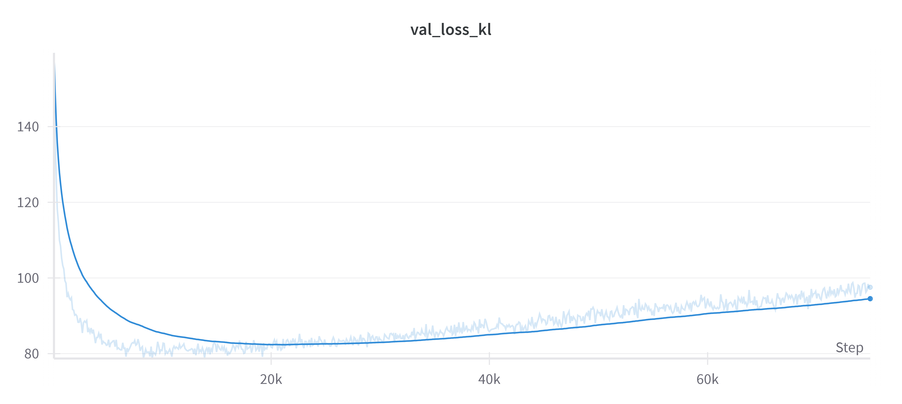
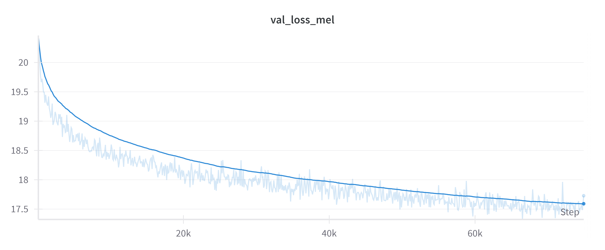

# Text to Speech

## Overview

This module focuses on building an emotional tts model for the Kazakh language. The model is fine-tuned to the Facebook/mms-tts-kaz model to synthesize audio based on text. The dataset used for fine-tuning is the EmoKaz, the new dataset (2024) focusing on six emotions: anger, happiness, fear, neutral, surprise, and sad. The finetuning script was adopted from [ylacombe](https://github.com/ylacombe/finetune-hf-vits). 

---

## Table of Contents

- [Repository Structure](#repository-structure)
- [Requireemnts](#requirements)
- [Data Preparation](#data-preparation)
- [Model Training](#model-training)
- [Results](#results)
  - [Comparison Table](#comparison-table)
  - [Loss Images](#loss-images)

---

## Repository Structure

```plaintext
finetune-hf-vits/       # Folder for fine-tuning VITS models
README.md               # Documentation for the repository
calculate_mcd.py        # Script to compute Mean Cepstral Distortion (MCD)
dataset.py              # Dataset handler for managing and loading data for testing dataset
normalize.py            # Script to normalize dataset features
prepare_mos.py          # Script for preparing MOS evaluation files
preprocess.py           # Preprocessing script for dataset preparation
test_finetune.py        # Script to test the fine-tuned VITS model
```
---

## Requirements

* transformers>=4.35.1
* datasets[audio]>=2.14.7
* accelerate>=0.24.1
* matplotlib
* wandb
* tensorboard
* Cython
---

## Data Preparation
To get the data, please visit the [form](https://docs.google.com/forms/d/e/1FAIpQLSeTg88cvRbZkR5Go1p0IkQxFnOJv2KL6j2WVcsa6ut4XzQp5g/viewform)
---

## Model training
To train the model, we used the code from [ylacombe](https://github.com/ylacombe/finetune-hf-vits), which was adapted for our dataset. The configurations for each emotion are stored in conf/*.

--
## Results

### Comparison table
|       N      |              |              |               |    **MCD**   |              |              |          |   MOS   |
|:------------:|:------------:|:------------:|:-------------:|:------------:|:------------:|:------------:|:--------:|:-------:|
|              | **neu (50)** | **ang (60)** | **hap (200)** | **sad (30)** | **sca (40)** | **sur (60)** | **Avg**  | **exp** |
| **F1 (805)** |  311.08      |  294.50      |  318.62       |  281.68      |  281.31      |  288.30      |  295.92  |  3.83   |
| **M1 (126)** |  317.14      |  310.98      |  311.08       |  328.89      |  328.74      |  311.79      |  318.10  |  3.67   |
| **M2 (399)** |  300.46      |  298.00      |  320.04       |  319.73      |  316.91      |  315.15      |  311.72  |  3.80   |
| **Average**  |  309.56      |  301.16      |  316.58       |  310.10      |  308.99      |  305.08      |  308.58  |  3.77   |

### Loss Images
Below are the loss images of the model trained on happy audio for 200 epochs.




